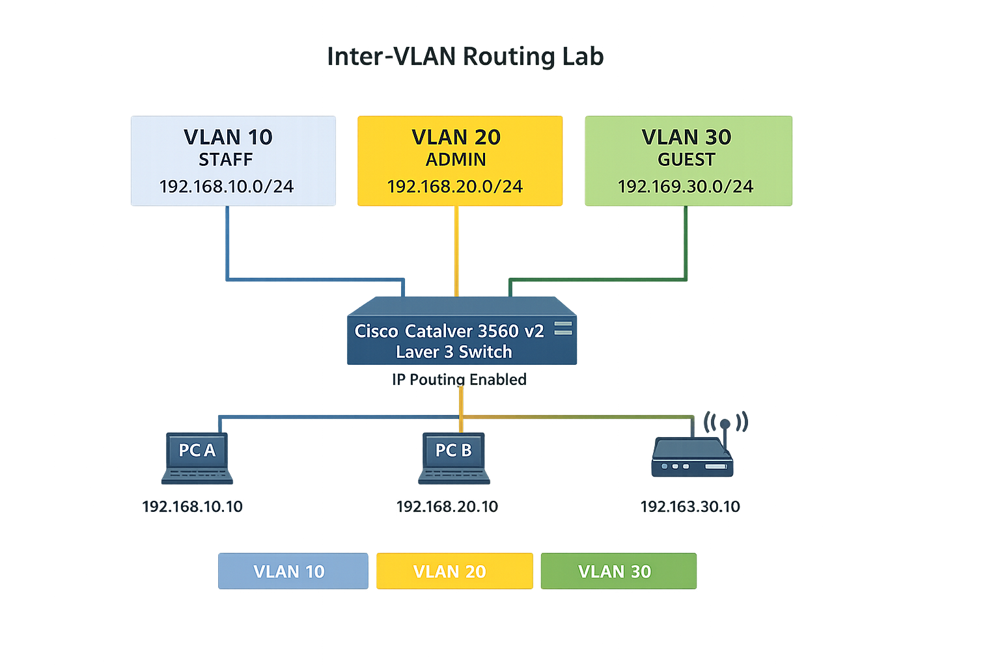

# Lab 01 – Inter-VLAN Routing on Cisco Catalyst 3560 v2

## Objective
Implement inter-VLAN routing and basic traffic control using a Layer-3 Cisco switch to reinforce CCNA-level and real-world enterprise networking concepts.

## Hardware Used
- Cisco Catalyst 3560 v2 (Layer-3 switch)
- End devices (PCs / laptops)
- Optional wireless access point (not required for core lab)

## VLANs and IP Design

| VLAN | Name  | Subnet |
|------|------|--------|
| 10 | STAFF | 192.168.10.0/24 |
| 20 | ADMIN | 192.168.20.0/24 |
| 30 | GUEST | 192.168.30.0/24 |

Default gateways are provided by Switch Virtual Interfaces (SVIs).

## Topology

## Verification & Outcome

- Inter-VLAN routing verified between STAFF, ADMIN, and GUEST VLANs
- Extended ACL applied inbound on VLAN 30 (GUEST)
- GUEST VLAN restricted from accessing STAFF and ADMIN VLANs
- Authorized inter-VLAN communication preserved
- ACL functionality confirmed using traffic tests and hit counters

This lab represents a completed, secured inter-VLAN routing scenario on real Cisco enterprise hardware.

## Notes
- Routing is performed on the switch using `ip routing`
- MikroTik router intentionally excluded to keep the lab Cisco- and CCNA-focused
